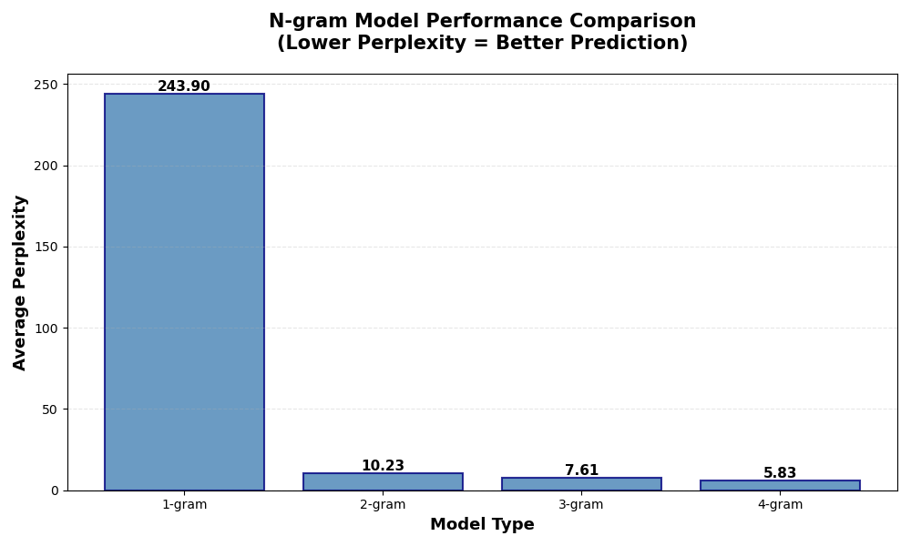

# N-gram Statistical Language Model: Build Your Own Text Generator from Scratch

## 🧠 Why This Project?

Ever wondered how your phone keyboard knows what word you might type next?

📱 Imagine writing a text message: start with “Thank”, and instantly “you” suggested by keyboard.

That little moment of “phone reads your mind” isn’t magic. It’s powered by a simple but powerful idea: **predicting the next word based on the words before it.**

This project recreates that logic from scratch using an **N-gram Statistical Language Model** from-scratch, and it can:

- Implemented the full pipeline: data preprocessing → model construction → text generation → visualization. 
- Train on real-world text, new sentences that appear “logical”
- Evaluate model quality using a standard NLP metric: **Perplexity**


## 🔍 What is an N-gram?

An **N-gram** is a contiguous sequence of **N words** from a given text. It can estimate the probability of a word given its previous context. The larger the value of N, the more the model captures **grammar and semantics**.

For example:
- **Unigrams (N=1):** "This", "is", "a", "sentence"
- **Bigrams (N=2):** "This is", "is a", "a sentence"
- **Trigrams (N=3):** "This is a", "is a sentence"
- **4-grams (N=4):** "This is a sentence"


👇 Below is a side-by-side comparison: a visual illustration of **N-grams** (left) and the actual **text outputs** generated by this project’s models (right):


## ✨ What Can It Do?

| Feature | Description |
|--------|-------------|
| 📖 Training Data | Novel *Frankenstein* by Mary Shelley (~78,000 words) |
| 🔁 N-gram Models | Implements 1-gram to 4-gram language models |
| 📝 Text Generation | Generates random text in *Frankenstein*'s writing style |
| 📉 Model Evaluation | Calculate **Perplexity** to assess language quality |
| 📊 Visualization | Charts comparing performance of each model |
| 🎨 Data Sparsity Analysis | Quantifies how many possible n-grams are actually observed in training data |


## 🧪 See It in Action:

### 1-gram Model (unigram)

The 1-gram model only uses each word's independent probability with no context; the generated output is just a random stack of words lacking grammatical structure:

>"my , and The rain of to . emaciated , Safie heard , I no in Sometimes make than " talk on beloved <END> where before . . the me"

### 2-gram Model (bigram)

>"My application . <END> Should she was a large . <END> I alighted and prepared myself ? <END> The God knows that crossed my various keys were altered to our"

### 3-gram Model (trigram)

>"My ancestors had been so miserable as I gazed on him as I commence my task . <END> The God of heaven , and which I believed in her last"

### 4-gram Model

The 4-gram model considers the previous 3 words as context, making the generated text resemble real literary sentences. The ability to capture context has improved!

>"My ancestors had been for many years , and they are sufficient to conquer all fear of ignominy or death . <END> Her garb was rustic , and her immutable"


## 🎯 How it Works?

👉 See **[ngram_language_model.py](ngram_language_model.py)** for the complete code for **n-gram model** implementation.

👉 See **[sample_outputs.txt](sample_outputs.txt)** for model output and analysis.

This project includes the full pipeline of a statistical language model:

- **Text Preprocessing**: **Tokenization** of raw text into words and punctuation marks using **regex patterns**

- **N-gram Extraction**: Train n-gram models (unigram through 4-gram) with context tuples and padding tokens (`<START>`, `<END>`)

- **Probability Modeling**: Calculate conditional probability `P(token|context)` by counting n-gram frequencies in training corpus

- **Text Generation**: Generate probabilistic text sequences using Markov chain sampling. Begin with `<START>`; Sample the next word based on probability; Repeat until `<END>` is reached

- **Perplexity Evaluation**: Compute perplexity metrics in log-space to evaluate model performance


## 📊 Results Summary


| Model  | Avg Perplexity | Improvement vs 1-gram | Generated Text Quality        |
|--------|------------|-----------------------|--------------------------------|
| 1-gram | 243.90     | baseline              | Incoherent random words        |
| 2-gram | 10.23      | 95.8% ↓               | Short grammatical phrases      |
| 3-gram | 7.61       | 96.9% ↓               | Coherent sentences             |
| 4-gram | 5.83       | 97.6% ↓               | Near-human prose               |

## 📊 Performance Analysis




## 🤔 Why Perplexity?

Perplexity measures model uncertainty:

$$\text{Perplexity} = \exp\left(-\frac{1}{N} \sum_{i=1}^{N} \log P(w_i \mid \text{context}_i)\right)$$


It is a standard metric for language models that measures how "surprised" the model is. Lower perplexity indicate model is less "perplexed", a better predictions. 
- The 1-gram model has a perplexity of 243.90 means the model is as uncertain as randomly choosing from ~244 words at each step. 
- The 4-gram model achieves 5.83, a **97.6% improvement**, meaning it confidently predicts the next word with high accuracy.


## 📈 Data Sparsity: Observed vs. Possible N-grams

As n increases, the gap between what we observe and what's theoretically possible grows exponentially:

| Model  | Unique n-grams (observed) | Possible n-grams (theoretical) |  Coverage | Issue |
|-------|------------------|------------------|----------|-------|
| 1-gram | 7,396          |7,396 (V¹)          |**100%** | ✅ None |
| 2-gram | 42,315         | 54.7 million (V²)           | **0.077%** | ⚠️ Emerging |
| 3-gram | 71,893         | 404 billion (V³)       | **0.000018%** | ⚠️⚠️ Significant |
| 4-gram | 81,680         | 3.0 trillion (V⁴)        |  **0.0000027%** | ❌ Severe |

## 💡 Observation:
- As n increases, generated text tends to sound more natural but may also become more repetitive (memorization effect).
- **Data sparsity** grows with n: As n increases, the training data cannot cover all possible word combinations. The model therefore encounters many (exponential) unseen n-grams, leading to sparsity and reduced generalization.

    for example, with 2-grams:

    - Vocabulary size: V = 7,396 words
    - Possible bigrams: V² = 54.7 million
    - Actual observed bigrams: 42,315 (0.077%)


## 🛠️ Technical Skills 

- **Language**: Python 3.8+
- **Libraries**: `string`, `re`, `random`, `math`, `collections`
- **Concepts**: Statistical NLP, Markov Chains, Conditional Probability

## 📁 Project Structure
```
ngram-language-model/
│
├── README.md                        # Project documentation and usage guide
├── LICENSE                          # MIT License
├── .gitignore                       # Git ignore rules
│
├── frankenstein.txt                 # Training corpus (~78K words)
├── sample_outputs.txt               # Detailed experimental results and analysis
│
├── ngram_language_model.py          # Core N-gram implementation
│
├── generate_text.py                 # Demo: generate random text
├── compare_models.py                # Demo: compare model performance and perplexity
└── visualize_perplexity.py          # Utility: create visualizations
```

## 🚀 Quick Start

Prerequisites
```bash
# Check Python version (requires 3.8+)
python --version

# Optional: Install matplotlib for visualizations
pip install matplotlib
```

Clone the repository
```bash
git clone https://github.com/Chengyuli33/ngram-perceptron-nlp.git
cd ngram-perceptron-nlp
```

Generate text with all n-gram models

```bash
python generate_text.py
```
Compare model perplexities

```bash
python compare_models.py
```
Visualize perplexity results
```bash
python visualize_perplexity.py
```
